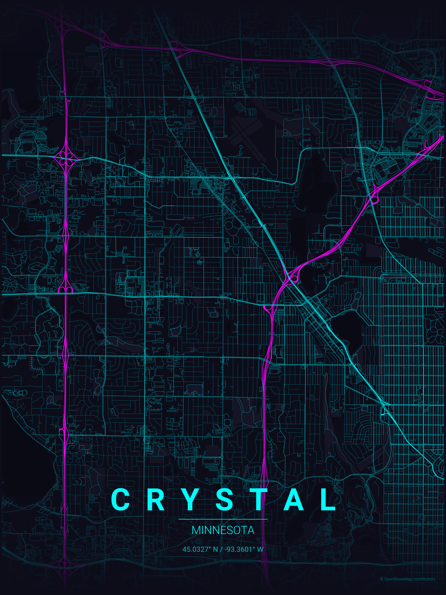
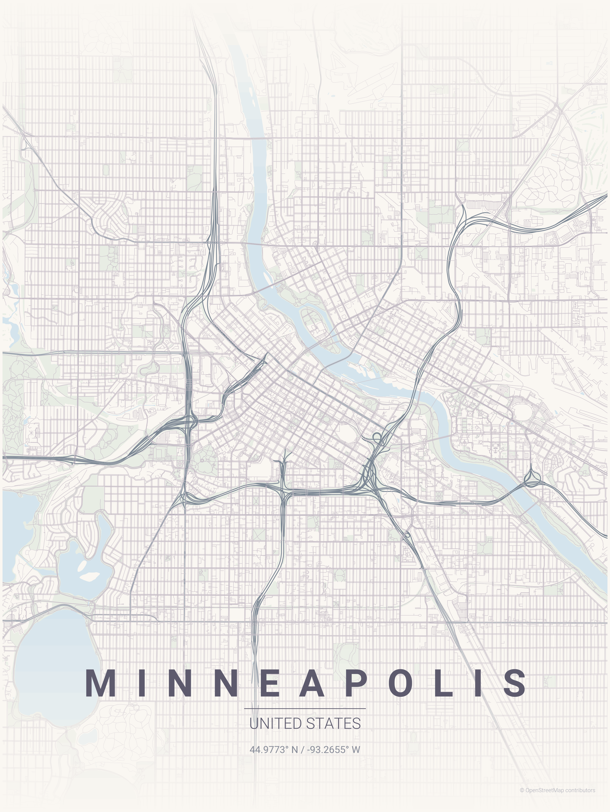

# Map Poster Streamlit

This is a Streamlit port of [MapToPoster](https://github.com/originalankur/maptoposter). All credit for the idea and original implementation goes to that project. I just wanted to run it with , a tool I'm more familiar with.





## Development

```bash
uv run streamlit run app.py
```

```bash
uv run ruff format
uv run ruff check
```

## Stack

- **Streamlit** — UI
- **OSMnx** — OpenStreetMap data fetching
- **Matplotlib** — map rendering

## Attributions

Map data © [OpenStreetMap](https://www.openstreetmap.org/).
